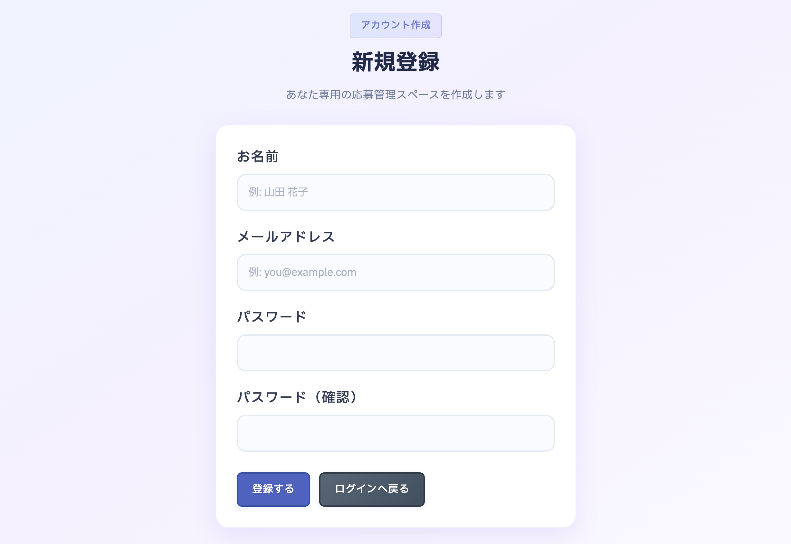
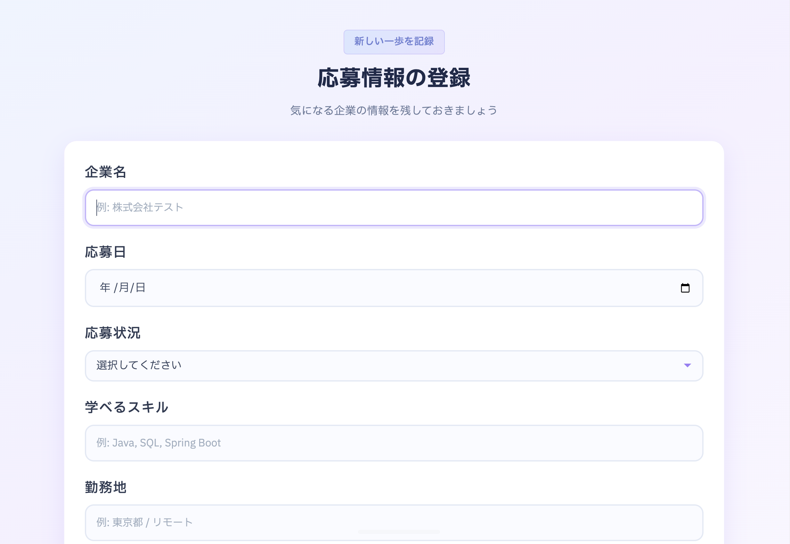
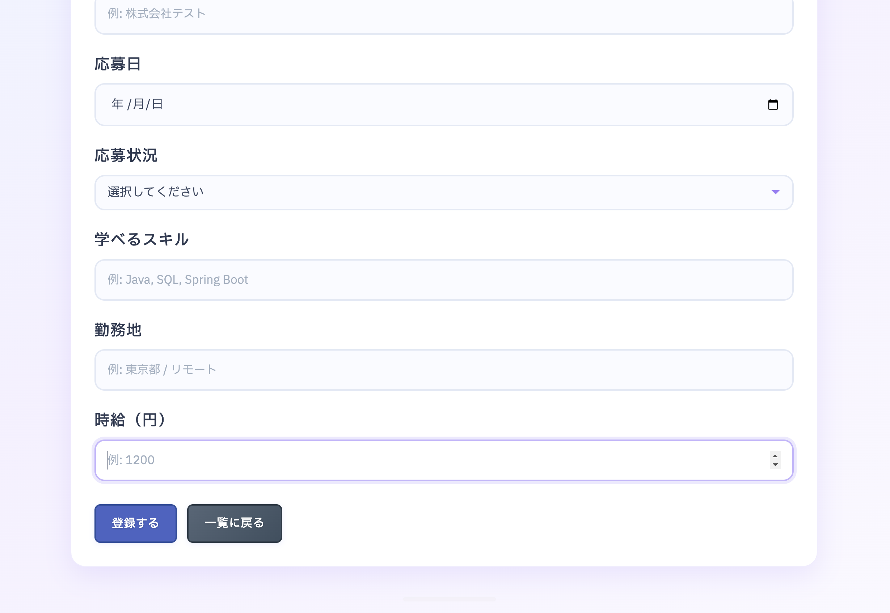
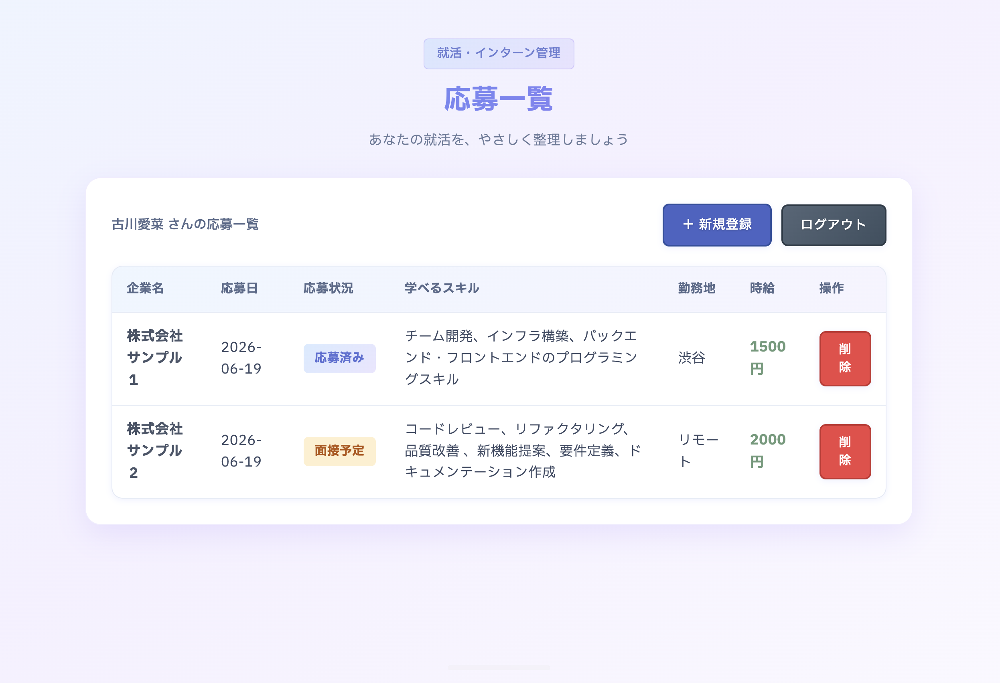

# インターンシップ管理アプリ

**リポジトリ:** https://github.com/aina-furukawa/internship-management-app

## 概要

応募したインターンシップの情報を管理できる Web アプリです。

企業名、応募日、選考状況、スキル、勤務地、時給、メモなどを登録・管理でき、応募状況を分かりやすく整理できます。  
Spring Security によるログイン機能で、ユーザーごとにデータが分離されます。

## 画面キャプチャ










## 使用技術

- Java 21
- Spring Boot 3.5
- Spring Security
- Spring Data JPA
- Thymeleaf
- MySQL
- HTML / CSS
- Maven

## 主な機能

- ユーザー登録・ログイン
- 応募情報の登録・一覧表示・編集・削除
- メモ機能
- データベースへの保存（ユーザーごとにデータ分離）

## 今後の予定

- 検索機能
- お気に入り機能
- AWS へのデプロイ

## 制作背景

就職活動やインターンシップ応募では、応募先や選考状況の管理が煩雑になりやすいため、それらを一元管理できるアプリを作成しました。

今後は機能追加や UI 改善を行い、実際の就職活動でも活用できるアプリを目指しています。

## ローカルでの起動方法

```bash
brew services start mysql
mysql -u root -p internship_db < scripts/login-migration.sql
# プロジェクトフォルダに移動してから
./mvnw spring-boot:run
```

http://localhost:8080 を開き、新規登録 → ログイン → 応募登録の順で利用できます。

## 作者

GitHub: [aina-furukawa/internship-management-app](https://github.com/aina-furukawa/internship-management-app)
